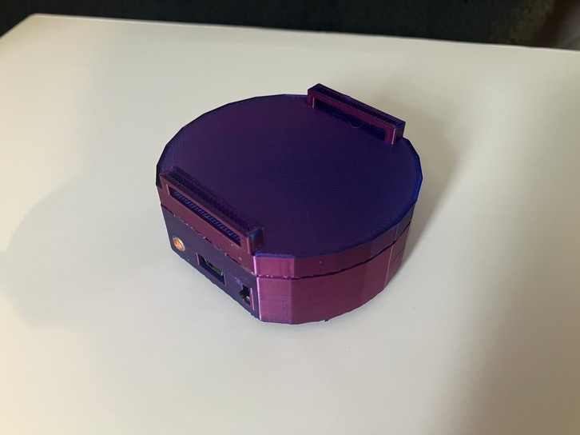
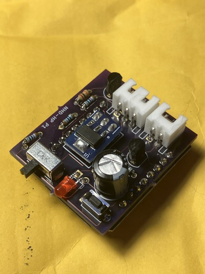
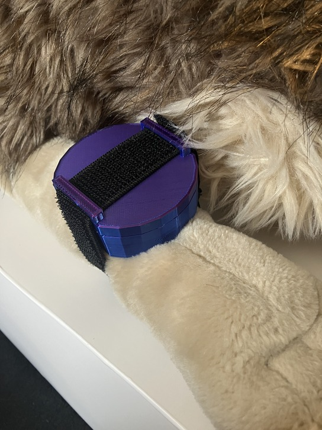
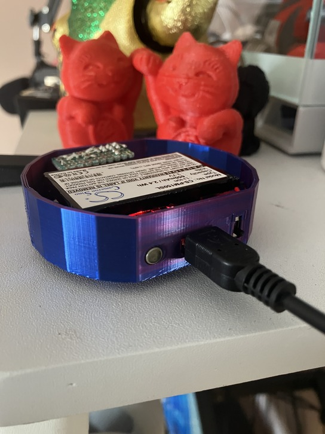

# HapticPuck

This repo contains all the code, models, and other resources needed to create a small, general purpose haptic feedback device.

The primary use case for this project is as a Haptic feedback device for VRChat (and a custom OSC router is included), but if you know how to code, or have basic knowledge of OSC than it could be used for a wide range of applications.

__Warning: This is a work in progress. You should consider this project to be prototype quality currently!__

## Disclaimer

I am just some random hobbyist on the internet who is sharing their personal project. This device has not been formally tested and I am not trained in electronic design/theory.

**Everything in this repo is to be used AT YOUR OWN RISK.**

If you build this device or use any component of this project you agree that I will not be held personally responsible for any harm that comes to you and/or others as a result of it.

## Supported Hardware

- NodeMCU
    - Fully tested and confirmed working, but not used in final design.
- Wemos D1 Mini
    - Fully tested and confirmed working

## Build Requirements

**Parts:**

| Item | Part # | Qty |
|------|--------|-----|
| Wemos Mini D1 | (No PN, can be found online) | 1 |
| Switch | 679-2452-ND (Digikey) | 1 |
| Switch | CKN9559-ND (Digikey) | 1 |
| 220uF 25v Capacitor | 1189-4161-ND (Digikey) | 1 |
| Red 3mm LED | 732-5006-ND (Digikey) | 1 |
| JST 2.5mm 2pos Connector | 455-S2B-EH-ND (Digikey) | 1 |
| JST 2.5mm 3pos Connector | 455-S3B-EH-ND (Digikey) | 1 |
| 20K 1/8W Axial Resistor | CF18JT20K0CT-ND (Digikey) | 1 |
| 1K 0.4W Axial Resistor | BC1.00KXCT-ND (Digikey) | 2 |
| 56ohm 0.4W Axial Resistor | 56-MRS16000C5609FCT00CT-ND (Digikey) | 1 |
| 10K | BC10.0KXCT-ND (Digikey) | 2 |
| 18350 Battery Holder | 36-1101-ND (Digikey) | 1 |
| 2N2222 NPN Transistor | 511-2N2222  (Mouser) | 2 |
| 10MM Phone Vibrator | JYC1030 (Digikey) | 2-4 |
| AMS1117 Module |  B0CWGPHK16 (Amazon ASIN) | 1 |
| TP4056 Module |  B07X8XPF74 (Amazon ASIN) | 1 |
| 18350 Rechargeable Li-ion Battery | (No PN, can be found online) | 1 |
| NHD-HP P1 PCB | Can be ordered from a service like OSHPark | 1 |
| Platinum silicone | Kits can be found on Amazon | ? |
-----------------------

**Non-parts:**
- The ability to 3d print.
    - Check out your local library, many have 3d printers these days for use at very low cost!
- The ability and tools to solder.
- Patience

## Repo Layout

### Case/

This folder contains all the 3D models used for the HapticPuck. These were created in SketchUp 2017 and I have provided both .DAE exports of the models and Gcode files for 3d printing.

The Gcode files were generated for my printer, the Elegoo Neptune 3 Pro and I can not guarantee they'll print fine on other 3D printers.

### PCB/

KiCAD schematic and PCB layout files. This is pretty self-explanatory.

### Firmware/

This folder contains different versions of the firmware for the microcontroller(s) that can run this project.

### NhdRouterServer/

A custom OSC router primarily intended for getting OSC commands from VRChat and forwarding them to the HapticPuck in a format that the firmware can understand.

### Resources/

Random repo specific resources like the image at the top of this readme.

## Images

